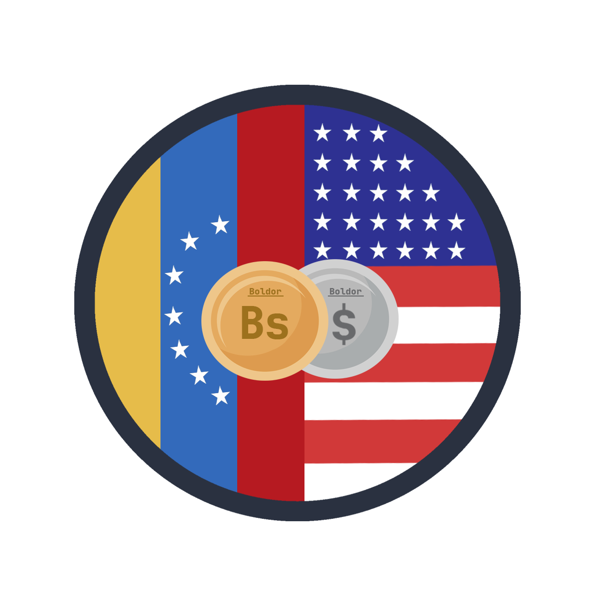

# boldorjs

## Work with the bolivar and the dollar as currencies in your projects.


For this library to work, you need to work with `Javascript modules`.

<hr>

## Development

Requirements:

- NodeJS

<hr>

Development process:

```
npm i boldorjs
```

or

```
yarn add boldorjs
```
